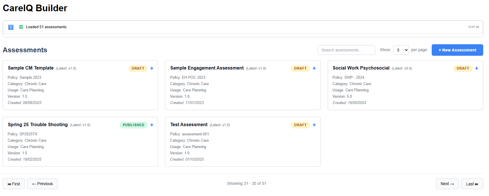
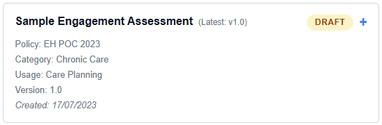
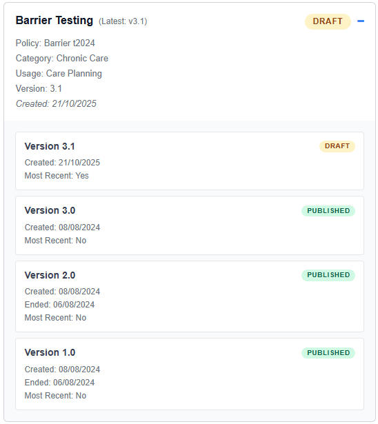
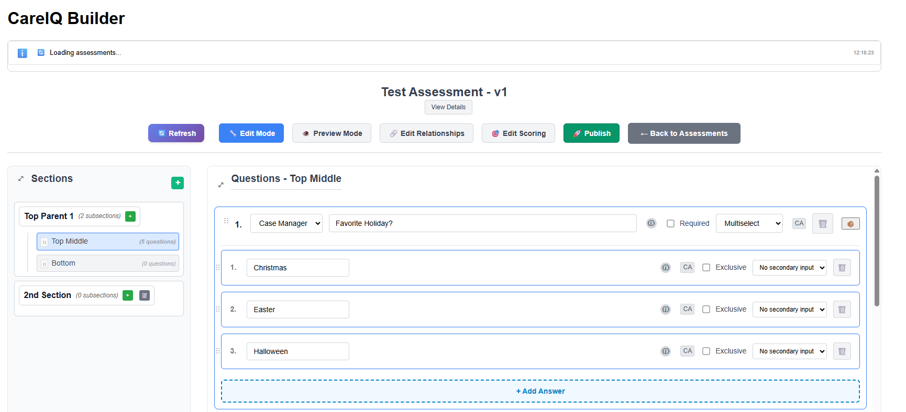

# CareIQ Builder - User Guide

## Introduction

### What is CareIQ Builder?

CareIQ Builder is a ServiceNow-based application that allows you to create, manage, and maintain clinical assessments for the CareIQ platform. With CareIQ Builder, you can:

- Create comprehensive clinical assessments with multiple sections
- Build questions with various input types (single select, multiselect, free text, numeric, date)
- Establish relationships between answers and clinical guidelines, problems, goals, and interventions
- Test assessments with conditional logic (triggered questions)
- Publish finalized assessments and create new versions
- Reuse content from the CareIQ library

### Who Should Use This Guide?

This guide is designed for:
- **Clinical Staff** creating and maintaining assessment content
- **Care Coordinators** building assessment workflows
- **Assessment Authors** managing clinical guidelines and questionnaires
- **Content Managers** responsible for assessment versioning and publication

### System Requirements

To use CareIQ Builder, you need:
- Access to the ServiceNow instance with CareIQ Builder installed
- Appropriate permissions to create and edit assessments
- A modern web browser (Chrome, Firefox, Edge, or Safari)
- Stable internet connection
- Screen resolution of at least 1400px width recommended for optimal experience

### Key Concepts

Before you begin, familiarize yourself with these key concepts:

#### **Assessments**
Self-contained clinical questionnaires with sections, questions, and answers. Each assessment has:
- A unique name and policy/code number
- A version number (e.g., v1.0, v2.0)
- A status (Draft or Published)
- An associated use case category (e.g., Chronic Care)

#### **Sections**
Organizational units within an assessment. Sections can:
- Contain multiple questions
- Be nested (parent sections with child subsections)
- Have names from the CareIQ library or custom names

#### **Questions**
Individual items within a section that collect information. Questions have:
- **Type**: Single Select, Multiselect, Free Text, Numeric, or Date
- **Voice**: Who asks/answers (Case Manager, Caregiver, or Patient)
- **Label**: The question text displayed to users
- **Answers**: Available response options (for select-type questions)

#### **Answers**
Response options for Single Select or Multiselect questions. Answers can:
- Trigger additional questions (conditional logic)
- Link to clinical guidelines, problems, goals, and interventions
- Include secondary inputs (e.g., "Other - please specify")
- Be marked as mutually exclusive

#### **Relationships**
Connections between answers and other clinical content:
- **Triggered Questions**: Questions that appear only when specific answers are selected
- **Guidelines**: Links to clinical practice guidelines
- **PGI (Problem-Goal-Intervention)**: Hierarchical clinical care plans
- **Barriers**: Obstacles to care delivery
- **Evidence**: Supporting research or documentation

#### **Edit vs Preview Mode**
- **Edit Mode**: Allows creating, editing, and deleting content
- **Preview Mode**: Read-only view for testing conditional logic and answer selections

#### **Draft vs Published Status**
- **Draft**: Editable assessment version
- **Published**: Read-only, finalized assessment (requires creating new version to edit)

### Document Structure

This user guide is organized into the following sections:

1. **Getting Started** - Initial setup and navigation
2. **Assessment Management** - Creating and managing assessments
3. **Section Management** - Organizing assessment structure
4. **Question and Answer Management** - Building assessment content
5. **Relationship Management** - Linking answers to clinical content
6. **Preview and Testing** - Testing conditional logic
7. **Publishing and Versioning** - Finalizing and creating new versions
8. **Troubleshooting and Best Practices** - Tips and common issues

### Getting Help

If you encounter issues or need additional assistance:
- Refer to the Troubleshooting section of this guide
- Contact your ServiceNow administrator
- Reach out to the CareIQ support team

---

## Getting Started

### Accessing CareIQ Builder

1. Log in to your ServiceNow instance
2. Navigate to the CareIQ Builder application (location depends on your organization's configuration)
3. The CareIQ Builder will load and display the assessment list

Upon loading, you should see:
- A connection status message: "Connected to CareIQ Platform"
- A search bar for filtering assessments
- A list of existing assessments organized by version
- A "+ New Assessment" button (if you have creation permissions)

---

---

### Understanding the Interface

The CareIQ Builder interface consists of several key areas:

#### **System Messages Ticker**
Located at the top of the screen, displays:
- Connection status
- Success messages (green)
- Warning messages (yellow)
- Error messages (red)
- Click to expand and view message history

#### **Assessment List View**
The main area showing all available assessments:
- **Search Box**: Filter assessments by name or policy number
- **Page Size Selector**: Show 5, 10, 25, or 50 assessments per page
- **Assessment Cards**: Display key information about each assessment
- **Expand Icon**: Click to view all versions of an assessment

#### **Assessment Card Information**
Each card displays:
- Assessment title
- Status badge (Draft or Published)
- Policy/code number
- Use case category
- Version number
- Created date

---

---

### Navigating the Assessment List

#### Searching for Assessments
1. Click in the search box at the top of the list
2. Type part of the assessment name or policy number
3. The list filters automatically as you type
4. Clear the search box to show all assessments

#### Changing Page Size
1. Click the page size selector (default: 10)
2. Choose from 5, 10, 25, or 50 assessments per page
3. The view updates immediately

#### Viewing Version History
1. Locate an assessment card with multiple versions
2. Click the expand icon (▼) on the card
3. All versions display with their status and dates
4. Click collapse icon (▲) to hide versions

---

---

### Opening an Assessment

To open an assessment for viewing or editing:

1. Locate the assessment in the list
2. Click the **"Open"** button on the assessment card
3. The builder interface loads with three main panels:
   - **Left Panel**: Sections hierarchy
   - **Center Panel**: Questions and answers for selected section
   - **Top Bar**: Mode toggles and action buttons

The assessment opens in **Edit Mode** by default if the assessment is in Draft status.

---

---

### Builder Interface Layout

Once an assessment is open, you'll see:

#### **Top Bar**
- **Assessment Title**: Displays current assessment name and version
- **Mode Toggle**: Switch between Edit and Preview modes
- **Publish Button**: Finalize assessment (Draft status only)
- **Back Button**: Return to assessment list

#### **Left Panel - Sections**
- **Section Hierarchy**: Tree view of all sections
- **Add Section Button**: Create new sections (Edit mode only)
- **Section Selection**: Click section to view its questions

#### **Center/Right Panel - Questions**
- **Selected Section Label**: Shows current section name
- **Questions List**: All questions in the selected section
- **Add Question Button**: Create new questions (Edit mode only)
- **Question Details**: Type, voice, label, and answers

#### **System Messages**
- Appears at top when actions occur
- Auto-dismisses after a few seconds
- Click to view full message history

---

---

### Basic Navigation

#### Moving Between Sections
1. Click any section name in the left panel
2. The center panel updates to show that section's questions
3. Currently selected section is highlighted

#### Expanding/Collapsing Panels
On smaller screens or for more space:
1. Click the toggle button on panel headers
2. Panels collapse to provide more room
3. Click again to expand

#### Responsive Design
The interface adapts to your screen size:
- **Wide screens (>1400px)**: All panels visible side-by-side
- **Medium screens**: Panels may stack or hide
- **Mobile**: Optimized mobile layout with collapsible panels

---

### Next Steps

Now that you understand the interface, proceed to:
- **Assessment Management** - Learn how to create new assessments
- **Section Management** - Organize your assessment structure
- **Question Management** - Build assessment content

