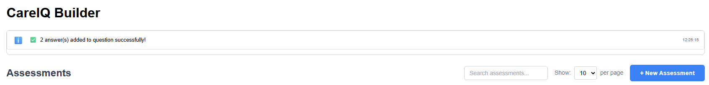
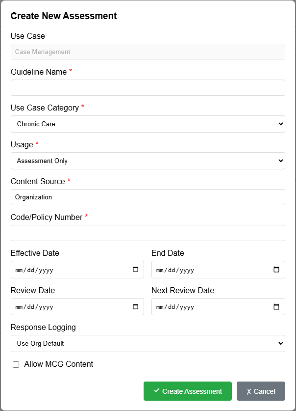
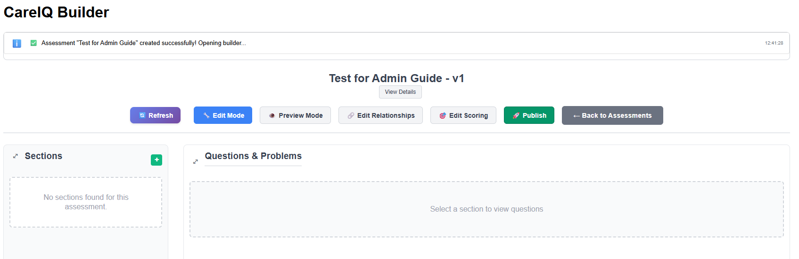
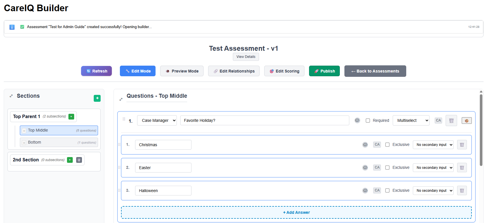
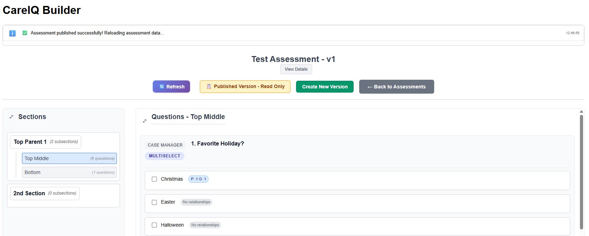
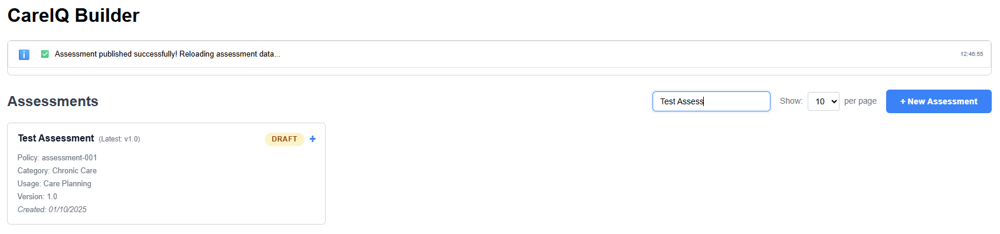
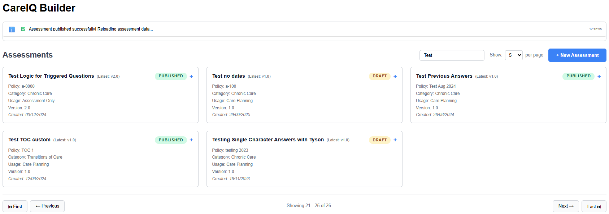

# Assessment Management

## Overview

Assessments are the foundation of the CareIQ Builder. This section covers creating, managing, searching, and organizing assessments.

---

## Creating a New Assessment

### Prerequisites
- You must have appropriate permissions to create assessments
- CareIQ Builder must be connected to the CareIQ platform

### Step-by-Step Instructions

1. **Open the New Assessment Form**
   - From the assessment list view, click the **"+ New Assessment"** button
   - A modal dialog appears with the assessment creation form

---



---

2. **Fill in Required Fields**

   The form includes the following fields:

   | Field | Description | Required |
   |-------|-------------|----------|
   | **Guideline Name** | The title of your assessment | Yes |
   | **Use Case Category** | Clinical category (e.g., Chronic Care) | Yes |
   | **Type** | Assessment type (Assessment Only, Assessment + Scoring, etc.) | Yes |
   | **Content Source** | Organization or CareIQ Library | Yes |
   | **Code/Policy Number** | Unique identifier for the assessment | Yes |
   | **Effective Date** | When the assessment becomes active | No |
   | **Review Date** | When the assessment should be reviewed | No |
   | **Response Logging** | Whether to log responses | No |

---



---

3. **Select Use Case Category**
   - Click the **"Use Case Category"** dropdown
   - Choose from available categories (e.g., Chronic Care, Acute Care, Behavioral Health)
   - Categories are loaded from CareIQ configuration

4. **Choose Assessment Type**
   - **Assessment Only**: Standard questionnaire
   - **Assessment + Scoring**: Includes scoring models for answer values
   - **Assessment with Library Content**: Uses pre-defined library content

5. **Enter Code/Policy Number**
   - This should be a unique identifier for your assessment
   - Used for searching and referencing the assessment
   - Example: "CC-001" or "POLICY-2024-001"

6. **Set Dates (Optional)**
   - **Effective Date**: When the assessment goes into effect
   - **Review Date**: When the content should be reviewed for updates
   - Leave blank if not applicable

7. **Create the Assessment**
   - Click the **"Create"** button
   - A success message appears
   - The new assessment opens in the builder

---



---

### What Happens After Creation?

When you create an assessment:
- A new record is created in the CareIQ platform
- The assessment is assigned version 1.0
- Status is set to "Draft" (editable)
- The assessment appears in your assessment list

---

## Opening an Existing Assessment

### To View or Edit an Assessment

1. **Locate the Assessment**
   - Use the search box to filter by name or policy number
   - Or scroll through the assessment list

2. **Click the Assessment Card**
   - Click the assessment card to open the latest version
   - The builder interface loads

3. **Builder Opens in Appropriate Mode**
   - **Draft assessments**: Open in Edit mode (you can make changes)
   - **Published assessments**: Open in Preview mode (read-only)

---
### Draft Mode (changes permitted)


---
### Published Mode (Readonly)


---

### Understanding Assessment Status

Assessments have two primary statuses:

#### **Draft Status** (Green Badge)
- Assessment is editable
- Can add, edit, and delete sections, questions, and answers
- Can modify relationships
- Can be published when ready
- Not yet finalized

#### **Published Status** (Blue Badge)
- Assessment is read-only
- Cannot be modified
- Used for active clinical assessments
- Must create a new version to make changes
- Shows "Create New Version" button instead of "Open" for editing

---

## Searching and Filtering Assessments

### Using the Search Box

The search box filters assessments in real-time:

1. **Click in the Search Box**
   - Located at the top of the assessment list

2. **Type Your Search Query**
   - Search by assessment name: "Diabetes Assessment"
   - Search by policy number: "CC-001"
   - Search is case-insensitive
   - Results filter as you type

3. **Clear the Search**
   - Delete text or click the clear icon
   - All assessments display again

---



---

### Search Tips

- **Partial matching**: Type part of the name (e.g., "Diab" finds "Diabetes Assessment")
- **Policy numbers**: Use unique codes for quick access
- **Case insensitive**: "diabetes" and "Diabetes" return same results
- **Real-time filtering**: No need to press Enter or click a button

---

## Viewing Assessment Versions

Assessments can have multiple versions over time. To view version history:

### Expanding Version History

1. **Locate an Assessment with Multiple Versions**
   - Look for the expand icon (▼) on assessment cards

2. **Click the Expand Icon**
   - The card expands to show all versions
   - Versions are listed chronologically

3. **View Version Information**
   Each version shows:
   - Version number (e.g., v1.0, v2.0)
   - Status (Draft or Published)
   - Created date
   - Ended date (if applicable)
   - Action buttons

---


---

4. **Collapse the View**
   - Click the collapse icon (▲) to hide versions
   - Only the latest version remains visible

### Understanding Version Numbers

- First version: **v1.0**
- Subsequent versions: **v2.0, v3.0, etc.**
- Each version is a complete copy of the assessment at the time of creation
- Published versions cannot be edited
- Draft versions can be edited freely

---

## Pagination

When you have many assessments, use pagination controls:

### Changing Items Per Page

1. **Click the Page Size Selector**
   - Located above the assessment list
   - Default: 10 assessments per page

2. **Choose a Page Size**
   - Options: 5, 10, 25, 50
   - Larger numbers reduce scrolling but increase load time

3. **Navigate Pages**
   - Use the pagination controls at the bottom
   - Click page numbers or next/previous buttons

---



---

## Assessment Card Details

Each assessment card displays important information:

### Card Components

```
┌─────────────────────────────────────────────┐
│ Assessment Title                      [▼]   │
│ ─────────────────────────────────────────── │
│ Status: [Draft] or [Published]              │
│ Policy Number: CC-001                       │
│ Category: Chronic Care                      │
│ Version: v1.0                               │
│ Created: 2024-01-15                         │
│                                             │
│                                             │
└─────────────────────────────────────────────┘
```

### Status Badges

- **Draft** (Green): Editable version
- **Published** (Blue): Read-only, finalized version

### Action Buttons

Depending on status, you'll see:
- **Open**: View/edit the assessment
- **Create New Version**: Make a new draft from published assessment
- **Publish**: Finalize a draft assessment (covered in Publishing section)

---

## Best Practices

### Naming Conventions

- **Use descriptive names**: "Diabetes Care Management Assessment" not "Assessment 1"
- **Include clinical area**: "Cardiac Rehab Initial Assessment"
- **Be consistent**: Follow your organization's naming standards

### Policy Numbers

- **Use unique identifiers**: Avoid duplicates
- **Follow a pattern**: "CC-001", "CC-002" (CC = Chronic Care)
- **Include year if helpful**: "POLICY-2024-001"

### Version Management

- **Publish when ready**: Don't leave assessments in draft indefinitely
- **Create versions for updates**: Don't try to edit published assessments
- **Document changes**: Keep notes on what changed between versions

### Organization

- **Use categories wisely**: Group similar assessments
- **Regular reviews**: Check review dates and update content
- **Archive old versions**: Work with administrators to clean up unused versions

---

## Common Tasks

### Finding a Specific Assessment

**Scenario**: You need to find the "Diabetes Management Assessment v2.0"

1. Type "Diabetes" in the search box
2. Locate "Diabetes Management Assessment"
3. Click expand icon to view all versions
4. Find v2.0 in the list
5. Click **"Open"** to view/edit

---

### Creating an Assessment Series

**Scenario**: Creating related assessments (Initial, Follow-up, Discharge)

1. Create first assessment: "Patient Care - Initial Assessment"
2. Use consistent policy numbers: "PC-INIT-001"
3. Complete and publish
4. Create second: "Patient Care - Follow-up Assessment"
5. Use related policy number: "PC-FU-001"
6. Continue pattern for series

---

### Checking Assessment Status

**Scenario**: Verifying which assessments are published vs draft

1. Scan assessment list for status badges
2. **Green badges** = Draft (work in progress)
3. **Blue badges** = Published (finalized)
4. Draft assessments can be edited immediately
5. Published assessments require creating new version

---

## Troubleshooting

### "Cannot Create Assessment" Error

**Possible causes:**
- Missing required fields
- Duplicate policy number
- No connection to CareIQ platform
- Insufficient permissions

**Solutions:**
1. Verify all required fields are filled
2. Check that policy number is unique
3. Ensure "Connected to CareIQ Platform" message is visible
4. Contact administrator to verify permissions

---

### Assessment Not Appearing in List

**Possible causes:**
- Active search filter
- Wrong page in pagination
- Assessment not yet created
- Page needs refresh

**Solutions:**
1. Clear the search box
2. Check all pages in pagination
3. Verify creation success message appeared
4. Refresh the browser page

---

### Cannot Open Assessment

**Possible causes:**
- Assessment loading
- Connection issue
- Permission problem

**Solutions:**
1. Wait for loading indicator to complete
2. Check system messages for errors
3. Verify connection status
4. Try refreshing the page
5. Contact administrator if problem persists

---

## Next Steps

Now that you understand assessment management:
- Learn how to **organize sections** in your assessment
- Build **questions and answers** for your sections
- Establish **relationships** between content
- **Test and publish** your completed assessment

