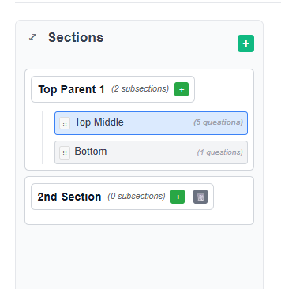
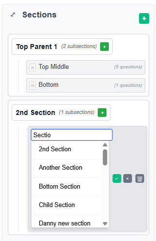
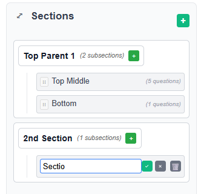
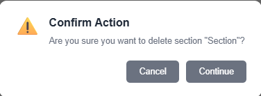
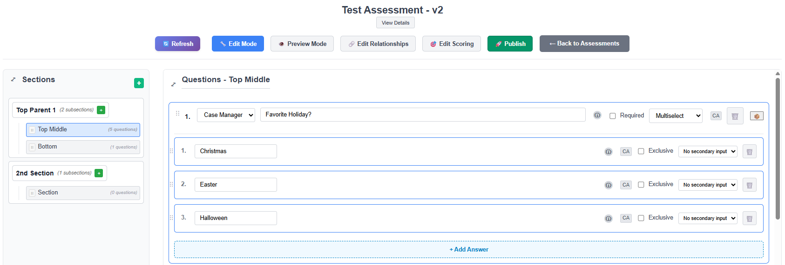

# Section Management

## Overview

Sections organize your assessment into logical groupings. They help structure content and make assessments easier to navigate. This section covers creating, editing, organizing, and deleting sections.

---

## Understanding Sections

### What Are Sections?

Sections are organizational containers within an assessment that:
- Group related questions together
- Can contain multiple questions
- Can be nested (parent sections with child subsections)
- Have names from the CareIQ library or custom names
- Maintain a specific order within the assessment

### Section Hierarchy

Sections support a parent-child structure:

```
Assessment
├── Section 1: Demographics (Parent)
│   ├── General Information (Child)
│   └── Contact Details (Child)
├── Section 2: Medical History (Parent)
│   ├── Current Conditions (Child)
│   ├── Medications (Child)
│   └── Allergies (Child)
└── Section 3: Assessment Questions (Parent)
```

---



---

## Creating a New Section

### Prerequisites
- Assessment must be in Draft status
- Builder must be in Edit mode
- You must have appropriate permissions

### Adding a Top-Level Section

1. **Open the Assessment**
   - Click **"Open"** on an assessment in Draft status
   - Builder interface loads

2. **Locate the Add Section Button**
   - Look in the left panel header (Sections area)
   - Click the **"+ Add Section"** or **"+"** button

---


---

3. **Enter Section Name**
   - A modal dialog appears with an input field
   - Type your section name (e.g., "Demographics", "Medical History")
   - Or use the typeahead search to find library sections

4. **Using Library Section Search**
   - As you type, matching library sections appear in a dropdown
   - Click a library section to select it
   - The section name populates automatically
   - Library sections may include pre-configured questions

5. **Save the Section**
   - Click **"Save"** or press Enter
   - The section appears in the left panel
   - The new section is automatically selected
   - You can now add questions to it

---



---

### Adding a Child Section (Subsection)

To create nested sections:

1. **Locate the Parent Section**
   - Find the section that should be the parent
   - Hover over the section name

2. **Click Add Child Section Button**
   - A **"+ Add Child"** or similar button appears
   - Click to open the subsection dialog

3. **Name the Subsection**
   - Enter a name or search library sections
   - Click **"Save"**

4. **View the Hierarchy**
   - The subsection appears indented under the parent
   - The hierarchy shows the relationship clearly

---


---

## Editing Section Names

### Quick Edit

1. **Double-Click the Section Name**
   - In the left panel, double-click the section you want to edit
   - The section name becomes an editable input field

2. **Modify the Name**
   - Edit the text directly
   - Or use typeahead to search library sections
   - Library matches appear as you type

3. **Save or Cancel**
   - Press **Enter** to save changes
   - Press **Escape** or click outside to cancel
   - Click the checkmark icon to save
   - Click the X icon to cancel

---



---

### Using Section Library Search

When editing section names:

1. **Start Typing**
   - The typeahead search activates
   - Matching library sections appear in a dropdown

2. **Review Search Results**
   - Each result shows:
     - Section name
     - Description (if available)
     - Source (CareIQ Library)

3. **Select from Library**
   - Click a result to use that library section
   - Or continue typing your custom name
   - Press Escape to close dropdown without selecting

4. **Confirm Selection**
   - Verify the name is correct
   - Click save or press Enter

---

## Deleting Sections

### Requirements for Deletion

A section can only be deleted if:
- Assessment is in Draft status
- Builder is in Edit mode
- Section has **no child sections** (subsections must be deleted first)
- You have appropriate permissions

### Delete a Section

1. **Locate the Section to Delete**
   - Find the section in the left panel
   - Ensure it has no child sections

2. **Click the Delete Button**
   - A delete button (trash icon or "×") appears when hovering
   - Click the delete button

---


---

3. **Confirm Deletion**
   - A confirmation dialog appears
   - Message: "Are you sure you want to delete this section?"
   - Additional warning if section contains questions

4. **Confirm or Cancel**
   - Click **"Delete"** to proceed
   - Click **"Cancel"** to abort
   - If confirmed, section is removed immediately

---



---

### Deleting Sections with Children

**Important**: You cannot delete a parent section while it has child sections.

To delete a parent section:

1. **Delete All Child Sections First**
   - Start with the bottommost child section
   - Delete each subsection one by one
   - Work your way up the hierarchy

2. **Then Delete the Parent**
   - Once all children are removed
   - Delete button becomes available on parent
   - Follow standard deletion process

---

### What Gets Deleted?

When you delete a section:
- The section record is removed from the backend
- All questions within that section are also deleted
- All answers associated with those questions are deleted
- All relationships for those answers are removed
- **This action cannot be undone**

---

## Reordering Sections

### Drag and Drop

Sections can be reordered within the hierarchy:

1. **Click and Hold a Section**
   - Click on a section name in the left panel
   - Hold the mouse button down

2. **Drag to New Position**
   - Move the section up or down
   - A visual indicator shows the drop position
   - Release the mouse button

3. **Automatic Save**
   - The new order is saved automatically
   - Sort order updates on the backend
   - Questions remain associated with their sections


---

### Reordering Rules

- Sections can be reordered within their level
- Parent sections can be moved among other parent sections
- Child sections can be moved among siblings
- Child sections cannot be moved outside their parent (use separate action to change parent)

---

## Selecting Sections

### Why Select a Section?

Selecting a section:
- Displays its questions in the main content area
- Allows you to add new questions to it
- Highlights the section in the left panel
- Sets the context for question management

### How to Select

1. **Click the Section Name**
   - In the left panel, click any section
   - The section becomes highlighted

2. **View Section Content**
   - The main content area updates
   - Shows all questions for that section
   - Section name appears as a header

3. **Add Questions**
   - With a section selected, click **"+ Add Question"**
   - New questions are added to the selected section

---



---

## Section Navigation

### Expanding and Collapsing

Parent sections can be expanded or collapsed:

1. **Expand a Parent Section**
   - Click the expand icon (▶) next to a parent section
   - Child sections become visible beneath it

2. **Collapse a Parent Section**
   - Click the collapse icon (▼)
   - Child sections hide from view
   - Questions in child sections remain intact

---

### Section Panel Visibility

On smaller screens or for more working space:

1. **Toggle Section Panel**
   - Click the panel toggle button
   - Sections panel collapses to the side
   - Provides more room for question content

2. **Reopen Section Panel**
   - Click toggle button again
   - Panel expands back into view

---

## Best Practices

### Organizing Content

**Use Logical Grouping**
- Group related questions together
- Example: All demographic questions in "Demographics" section
- Example: All medical history in "Medical History" section

**Create Clear Hierarchies**
- Use parent sections for broad categories
- Use child sections for specific sub-topics
- Example:
  ```
  Medical History (Parent)
    ├── Current Conditions (Child)
    ├── Past Surgeries (Child)
    └── Family History (Child)
  ```

**Keep Section Names Clear**
- Use descriptive names: "Current Medications" not "Meds"
- Be consistent: "Patient Information" and "Caregiver Information" (parallel structure)
- Avoid abbreviations unless standard in your organization

---

### Using Library Sections

**When to Use Library Sections**
- Starting a new assessment in a common clinical area
- Leveraging pre-built, validated content
- Ensuring consistency across assessments

**When to Use Custom Sections**
- Organization-specific content
- Unique clinical workflows
- Specialized assessments

**Combining Library and Custom**
- Use library sections as a starting point
- Add custom sections for specific needs
- Edit library section names if needed

---

### Section Depth

**Recommended Hierarchy Depth**
- **One level** (no nesting): Simple assessments with few questions
- **Two levels** (parent + children): Most assessments
- **Avoid deep nesting**: Don't go beyond two levels (parent → child)

**Why Limit Depth?**
- Easier navigation for users
- Clearer organization
- Better user experience during assessment completion

---

## Common Tasks

### Creating a Standard Assessment Structure

**Scenario**: Setting up a typical patient assessment

1. Create parent section: "Demographics"
   - Add child: "Personal Information"
   - Add child: "Contact Information"

2. Create parent section: "Medical History"
   - Add child: "Current Conditions"
   - Add child: "Medications"
   - Add child: "Allergies"

3. Create parent section: "Assessment"
   - Add child: "Physical Assessment"
   - Add child: "Psychosocial Assessment"

4. Create parent section: "Care Plan"
   - Add child: "Goals"
   - Add child: "Interventions"

---

### Reorganizing Existing Sections

**Scenario**: Improving assessment structure after initial creation

1. Review current section organization
2. Identify sections that should be grouped
3. Create new parent section if needed
4. Move related sections under parent
5. Delete redundant sections
6. Reorder sections for logical flow

---

### Renaming Sections for Consistency

**Scenario**: Standardizing section names across assessments

1. Open first assessment
2. Double-click section to edit
3. Use consistent naming (e.g., "Demographics" instead of "Patient Info")
4. Save changes
5. Repeat for other assessments
6. Document naming standards for future use

---

## Troubleshooting

### Cannot Add Section

**Possible causes:**
- Assessment is Published (not Draft)
- Builder is in Preview mode (not Edit mode)
- Insufficient permissions

**Solutions:**
1. Verify assessment status badge shows "Draft"
2. Click **"Edit Mode"** button if in Preview
3. Contact administrator to verify permissions

---

### Cannot Delete Section

**Possible causes:**
- Section has child sections (must delete children first)
- Assessment is Published
- Builder is in Preview mode

**Solutions:**
1. Check if section has subsections (indented items beneath it)
2. Delete all child sections first
3. Verify assessment is in Draft status
4. Ensure Edit mode is active

---

### Section Changes Not Saving

**Possible causes:**
- Network connection issue
- Session timeout
- Backend error

**Solutions:**
1. Check system messages for errors
2. Verify connection status at top of screen
3. Try refreshing the page
4. Check browser console for errors
5. Contact administrator if problem persists

---

### Section Disappeared After Refresh

**Possible causes:**
- Changes were not saved
- Section was deleted by another user
- Data synchronization issue

**Solutions:**
1. Check if confirmation message appeared after creation
2. Look in all parent sections (may have been created under wrong parent)
3. Use search to locate section
4. Contact administrator to check audit logs

---

### Drag and Drop Not Working

**Possible causes:**
- Browser compatibility issue
- JavaScript error
- Permissions problem

**Solutions:**
1. Try refreshing the page
2. Use a supported browser (Chrome, Firefox, Edge, Safari)
3. Check browser console for errors
4. Contact administrator if issue persists

---

## Tips and Tricks

### Keyboard Shortcuts

When editing section names:
- **Enter**: Save changes
- **Escape**: Cancel editing
- **Tab**: Move to next editable field (if applicable)

---

### Quick Navigation

- Click section names to quickly switch between them
- Use expand/collapse to focus on specific areas
- Collapse unused sections to reduce visual clutter

---

### Planning Section Structure

Before building:
1. Sketch out your assessment structure on paper
2. Identify main categories (parent sections)
3. List sub-topics (child sections)
4. Group related questions
5. Create sections in the builder based on your plan

---

## Next Steps

Now that you understand section management:
- Learn how to **add questions** to your sections
- Build **answers** for different question types
- Establish **relationships** between content
- **Test your assessment** in Preview mode

