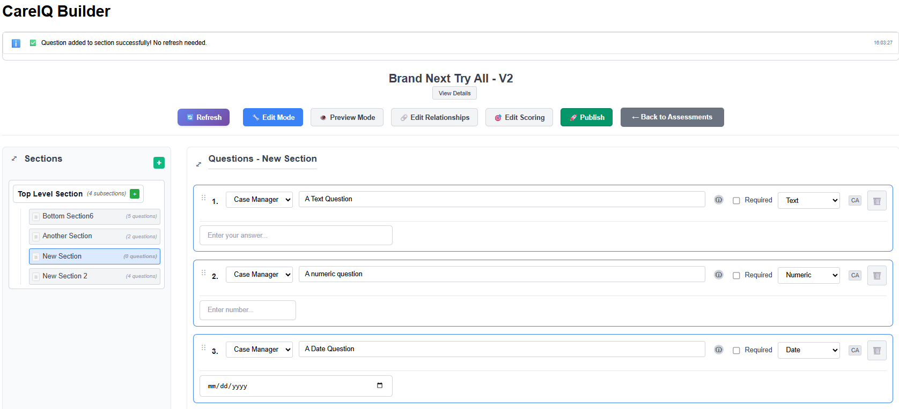
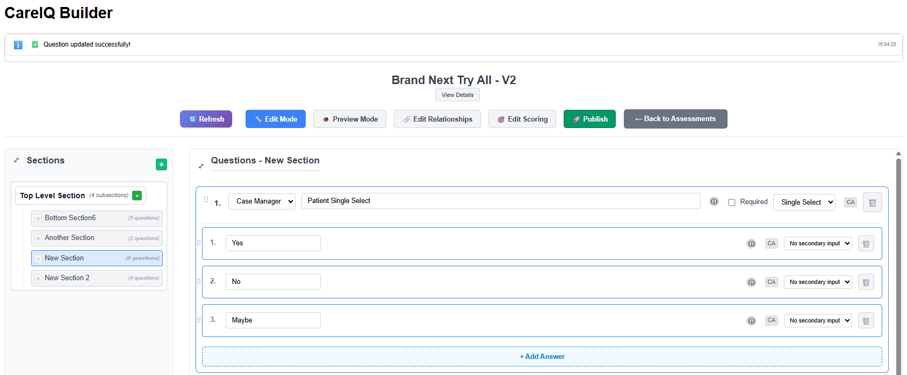
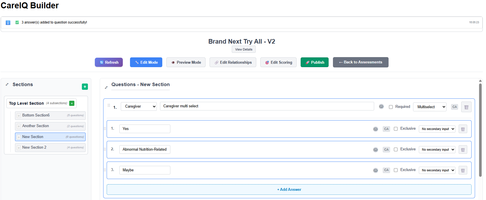
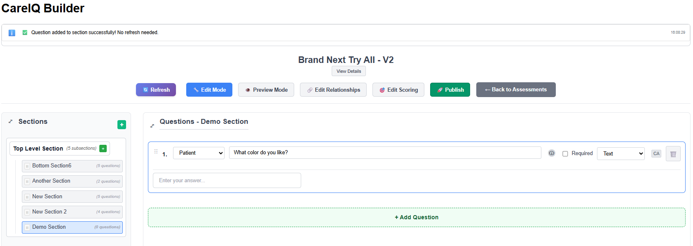
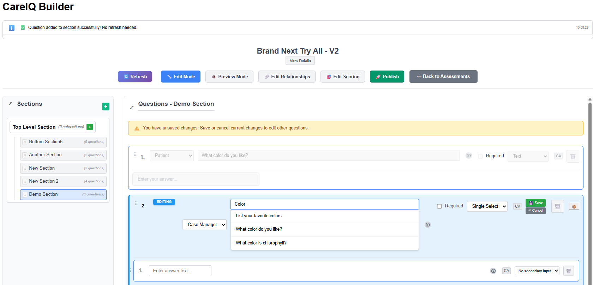
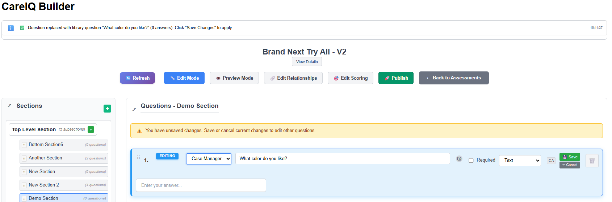

# Question and Answer Management

## Overview

Questions and answers are the core content of your assessment. This section covers creating, editing, and managing questions and their associated answers.

---

## Understanding Questions

### What Are Questions?

Questions are individual items within a section that collect information from users. Each question has:

- **Label/Text**: The question displayed to users
- **Type**: How the question is answered
- **Voice**: Who asks or answers the question
- **Answers**: Available response options (for select-type questions)
- **Tooltip**: Optional help text for clarification

### Question Types

CareIQ Builder supports five question types:

| Type | Description | User Interface | Use Case |
|------|-------------|----------------|----------|
| **Single Select** | Choose one option | Radio buttons | "What is your age range?" |
| **Multiselect** | Choose multiple options | Checkboxes | "Select all symptoms that apply" |
| **Free Text** | Open-ended response | Text input field | "Please describe your symptoms" |
| **Numeric** | Number input | Number field | "How many medications do you take?" |
| **Date** | Date selection | Date picker | "When was your last visit?" |

---

---

### Question Voice

The voice indicates who asks or answers the question:

- **Case Manager**: Questions asked by care coordinators
- **Caregiver**: Questions directed to family members or caregivers
- **Patient**: Questions answered directly by the patient

---

## Creating Questions

### Prerequisites
- Assessment must be in Draft status
- Builder must be in Edit mode
- A section must be selected
- You must have appropriate permissions

### Adding a New Question

1. **Select a Section**
   - Click a section in the left panel
   - The section's questions display in the main area

2. **Click Add Question Button**
   - At the bottom of the questions list
   - Click **"+ Add Question"** button

---

---

3. **Question Appears**
   - A new question card appears with default values
   - Question label shows placeholder text: "New Question"
   - Default type: Single Select
   - Default voice: Case Manager

4. **Edit the Question Label**
   - Click in the question label field
   - Type your question text

---

5. **Select Question Type**
   - Click the **Type** dropdown
   - Choose from: Single Select, Multiselect, Free Text, Numeric, Date
   - The answer section updates based on type

6. **Select Question Voice**
   - Click the **Voice** dropdown
   - Choose: Case Manager, Caregiver, or Patient
   - Voice is saved automatically

7. **Add Answers** (for Single Select and Multiselect only)
   - See "Creating Answers" section below
   - Free Text, Numeric, and Date questions don't have predefined answers

---

### Using Library Questions

You can search and use pre-built questions from the CareIQ library:

1. **Start Editing Question Label**
   - Click in the question label field
   - A typeahead search activates

2. **Type to Search Library**
   - As you type, matching library questions appear
   - Results show question text and metadata

---

---

3. **Select from Library**
   - Click a library question from the dropdown
   - The question label, type, and voice populate automatically
   - Answers may also be pre-populated from library

4. **Or Use Custom Question**
   - Continue typing your custom question
   - Press Escape to close the dropdown
   - Enter your own question text

---

### Adding Tooltips to Questions

Tooltips provide additional help or clarification:

1. **Locate Tooltip Field**
   - Below or beside the question label
   - Click **"Add Tooltip"** or in the tooltip input field

2. **Enter Tooltip Text**
   - Type helpful information
   - Example: "Include prescription and over-the-counter medications"

3. **Save**
   - Tooltip saves automatically or when question is saved
   - Tooltip appears as an info icon (ⓘ) next to question in assessment

---

## Editing Questions

### Edit Question Label

**Inline Editing**
1. Click in the question label field
2. Edit the text directly
3. Changes are tracked (Save/Cancel buttons appear)

---

### Change Question Type

1. **Click Type Dropdown**
   - Locate the question type selector
   - Current type is displayed

2. **Select New Type**
   - Choose a different type
   - Warning: Changing type may affect answers

3. **Impact on Answers**
   - Changing from Single Select to Multiselect: Answers remain
   - Changing to Free Text/Numeric/Date: Answers may become inapplicable
   - Confirm the change

---

### Change Question Voice

1. **Click Voice Dropdown**
   - Locate the voice selector
   - Current voice is displayed

2. **Select New Voice**
   - Choose: Case Manager, Caregiver, or Patient
   - Voice updates immediately

---

### Save Question Changes

After editing a question:

1. **Changes Are Tracked**
   - An "unsaved" indicator appears
   - **Save** and **Cancel** buttons display

---

---

2. **Click Save Button**
   - Saves all changes for this question
   - API call updates the backend
   - Success message appears
   - Save/Cancel buttons disappear

3. **Click Cancel Button**
   - Discards all unsaved changes
   - Question reverts to previous state
   - Save/Cancel buttons disappear

---

## Deleting Questions

### Delete a Question

1. **Locate Delete Button**
   - Find the question to delete
   - Look for delete button (trash icon or "Delete" text)

2. **Click Delete Button**
   - A confirmation dialog appears

---

**Screenshot Placeholder 29**: Delete question confirmation dialog

---

3. **Confirm Deletion**
   - Dialog message: "Are you sure you want to delete this question?"
   - Warns that all answers will also be deleted
   - Click **"Delete"** to proceed or **"Cancel"** to abort

4. **Question Removed**
   - Question and all its answers are deleted from backend
   - Question disappears from the list
   - Success message appears

---

### What Gets Deleted?

When you delete a question:
- The question record is removed
- All associated answers are deleted
- All relationships for those answers are removed
- Any triggered question links are broken
- **This action cannot be undone**

---

## Moving Questions Between Sections

You can move questions from one section to another:

### Move a Question

1. **Locate the Move Button**
   - Find the question to move
   - Click **"Move to Section"** or similar button

2. **Select Target Section**
   - A dropdown or modal appears with available sections
   - Choose the destination section

---

**Screenshot Placeholder 30**: Move question dialog with section selector

---

3. **Confirm Move**
   - Click **"Move"** or **"Confirm"**
   - A loading indicator appears

4. **Question Moves**
   - Question is added to the target section
   - Question is removed from the current section
   - Success message appears

5. **Verify Move**
   - Navigate to the target section
   - Confirm the question appears there

---

## Understanding Answers

### What Are Answers?

Answers are response options for Single Select and Multiselect questions. Each answer has:

- **Label**: The text displayed to the user
- **Alternative Wording**: Optional variations of the answer
- **Tooltip**: Optional help text
- **Mutually Exclusive**: Flag indicating this answer excludes other options
- **Secondary Input**: Additional input required when this answer is selected

### Secondary Input Types

Some answers require additional information:

| Secondary Input Type | Description | Example |
|---------------------|-------------|---------|
| **None** | No additional input | "Yes" or "No" |
| **Text** | Free text input | "Other (please specify)" |
| **Date** | Date picker | "If yes, when?" |
| **Numeric** | Number input | "How many?" |

---

## Creating Answers

### Prerequisites
- Question must be Single Select or Multiselect type
- Assessment must be in Draft status
- Builder must be in Edit mode

### Adding an Answer

1. **Locate Add Answer Button**
   - Under the question, in the answers area
   - Click **"+ Add Answer"** button

---

**Screenshot Placeholder 31**: Add Answer button location

---

2. **Answer Appears**
   - A new answer card appears
   - Default label: "New Answer" or placeholder text
   - Default settings applied

3. **Edit Answer Label**
   - Click in the answer label field
   - Type your answer text
   - Example: "Yes", "No", "18-25 years", "Diabetes"

4. **Or Use Library Answer**
   - As you type, typeahead search activates
   - Matching library answers appear
   - Click a library answer to use it
   - Or continue with custom text

---

**Screenshot Placeholder 32**: Answer typeahead dropdown

---

5. **Configure Answer Options**
   - Set secondary input type if needed
   - Mark as mutually exclusive if applicable
   - Add tooltip for clarification

---

### Setting Secondary Input Type

For answers requiring additional information:

1. **Locate Secondary Input Dropdown**
   - Below or beside the answer label
   - Default: None

2. **Select Input Type**
   - **None**: No additional input required
   - **Text**: User can type additional details
   - **Date**: User must select a date
   - **Numeric**: User must enter a number

3. **Example Use Cases**
   - "Other (please specify)" → Text input
   - "Previous diagnosis (when?)" → Date input
   - "Number of hospitalizations" → Numeric input

---

**Screenshot Placeholder 33**: Secondary input type selector

---

### Marking Mutually Exclusive

Mutually exclusive answers prevent other selections:

1. **Locate Mutually Exclusive Checkbox**
   - In the answer configuration area
   - Label: "Mutually Exclusive" or similar

2. **Check the Box**
   - Indicates this answer excludes all other options
   - Typically used for "None", "Not Applicable", "Decline to Answer"

3. **Behavior**
   - When user selects this answer, all other answers are deselected
   - Only applies to Multiselect questions
   - Example: "None of the above" in a symptom list

---

## Editing Answers

### Edit Answer Label

1. **Click in Answer Label Field**
   - Click to activate inline editing
   - Or use typeahead to search library

2. **Modify Text**
   - Edit the answer text
   - Or select from library results

3. **Save Changes**
   - Changes are tracked automatically
   - Click **Save** button at question level to persist all changes

---

### Add Alternative Wording

Alternative wording provides variations of the answer for different contexts:

1. **Locate Alternative Wording Field**
   - Below or beside the main answer label
   - May be labeled "Alt Wording" or similar

2. **Enter Alternative Text**
   - Type an alternative phrasing
   - Example: Answer "Yes" could have alt wording "Affirmative"

3. **Use Cases**
   - Report generation with different terminology
   - Multi-language support
   - Clinical vs. patient-friendly language

---

### Add Answer Tooltip

1. **Locate Tooltip Field**
   - In the answer configuration area
   - Click **"Add Tooltip"** if not visible

2. **Enter Tooltip Text**
   - Provide clarification or examples
   - Example: "Select this if symptoms have lasted more than 3 months"

3. **Tooltip Display**
   - Appears as an info icon next to answer in assessment
   - User hovers or clicks to see tooltip text

---

## Deleting Answers

### Important: Two-Step Delete Process

Answer deletion uses a **Save & Delete** pattern:

1. **Click Delete Button**
   - Locate the delete button on the answer
   - Click to mark answer for deletion

2. **Answer Marked for Deletion**
   - Answer may show visual indicator (strikethrough, red background, etc.)
   - Answer is NOT yet deleted from backend

---

**Screenshot Placeholder 34**: Answer marked for deletion

---

3. **Click Save Button**
   - At the question level, click **"Save"** button
   - Confirms deletion

4. **Or Click Cancel**
   - Click **"Cancel"** to undo the deletion
   - Answer returns to normal state

5. **Deletion Complete**
   - After clicking Save, answer is removed from backend
   - Success message appears
   - Answer disappears from list

---

### Why Two-Step Deletion?

- Prevents accidental deletions
- Allows multiple changes before saving
- Groups all modifications into one save operation
- Provides clear undo mechanism

---

## Managing Triggered Questions

### What Are Triggered Questions?

Triggered questions (also called "branch questions") appear only when specific answers are selected. They enable conditional logic in assessments.

### Viewing Triggered Questions

Answers with triggered questions show an indicator:

1. **Look for Link Icon**
   - Appears on answer cards
   - May show a number (e.g., "2 triggered questions")

---

**Screenshot Placeholder 35**: Answer with triggered question indicator

---

2. **View Triggered Questions**
   - Icon shows how many questions are triggered
   - Questions appear when answer is selected in Preview mode

### Adding Triggered Questions

Adding relationships is covered in the "Relationship Management" section, but here's a quick overview:

1. Click the relationship button on an answer
2. Navigate to the "Questions" tab
3. Search for questions to trigger
4. Select and confirm

### Removing Triggered Questions

1. **Locate Delete Button**
   - On the triggered question indicator
   - Click the "×" or delete button

2. **Confirm Deletion**
   - Confirmation dialog appears
   - Click **"Delete"** to remove relationship

3. **Relationship Removed**
   - Triggered question link is deleted
   - Question still exists but is no longer triggered by this answer

---

## Best Practices

### Question Writing

**Be Clear and Concise**
- Use simple language
- Avoid medical jargon unless appropriate for audience
- Example: "Do you have diabetes?" vs. "Have you been diagnosed with diabetes mellitus?"

**One Question, One Concept**
- Don't combine multiple questions
- Bad: "Do you smoke or drink alcohol?"
- Good: Two separate questions for smoking and alcohol

**Use Appropriate Question Types**
- Single Select: When only one answer is valid
- Multiselect: When multiple answers apply
- Free Text: When you need detailed, open-ended responses
- Numeric: When collecting measurements or counts
- Date: When timing is important

---

### Answer Writing

**Provide Complete Options**
- Include all reasonable choices
- Add "Other (please specify)" with text input for unlisted options
- Include "Prefer not to answer" or "Unknown" when appropriate

**Use Parallel Structure**
- Keep answer formats consistent
- Example: "Daily", "Weekly", "Monthly", "Yearly" (not "Every day", "Once a week", etc.)

**Order Answers Logically**
- Chronological: "Never", "Former", "Current"
- Numerical: "0-5", "6-10", "11-15", "16+"
- Alphabetical: For long lists of items
- Most to least common: For symptom lists

---

### Voice Selection

**Case Manager Voice**
- Questions the care coordinator asks
- Administrative or assessment questions
- Example: "What is the patient's primary language?"

**Patient Voice**
- Questions answered by the patient
- Personal experience and symptoms
- Example: "How would you rate your pain level?"

**Caregiver Voice**
- Questions directed to family or caregivers
- Observations about the patient
- Example: "Have you noticed changes in memory or behavior?"

---

### Secondary Inputs

**When to Use Text Input**
- "Other" options: "Other (please specify)"
- Additional details: "If yes, please describe"

**When to Use Date Input**
- Timing of events: "If yes, when did this occur?"
- Historical dates: "Date of diagnosis"

**When to Use Numeric Input**
- Counts: "How many medications?"
- Measurements: "Weight in pounds"
- Ratings: "On a scale of 1-10"

---

### Mutually Exclusive Answers

**Use for:**
- "None of the above" in multiselect lists
- "Not applicable" options
- "Decline to answer" choices

**Don't use for:**
- Regular answer options
- Answers that can logically coexist with others

---

## Common Tasks

### Creating a Yes/No Question

1. Add question: "Have you been diagnosed with diabetes?"
2. Set type: Single Select
3. Set voice: Case Manager or Patient
4. Add answer: "Yes"
5. Add answer: "No"
6. Save question

---

### Creating a Symptom Checklist

1. Add question: "Select all symptoms you are currently experiencing"
2. Set type: Multiselect
3. Set voice: Patient
4. Add answers: "Headache", "Nausea", "Dizziness", "Fatigue", "Other"
5. Set "Other" answer secondary input: Text
6. Add answer: "None of the above"
7. Mark "None of the above" as mutually exclusive
8. Save question

---

### Creating an Age Range Question

1. Add question: "What is your age?"
2. Set type: Single Select
3. Set voice: Patient
4. Add answers: "Under 18", "18-25", "26-35", "36-45", "46-55", "56-65", "66+"
5. Save question

---

### Creating a Free Text Question

1. Add question: "Please describe your current symptoms in detail"
2. Set type: Free Text
3. Set voice: Patient
4. Add tooltip: "Include when symptoms started and any patterns you've noticed"
5. Save question (no answers needed for Free Text)

---

### Creating a Numeric Question

1. Add question: "How many medications are you currently taking?"
2. Set type: Numeric
3. Set voice: Patient
4. Add tooltip: "Include prescription and over-the-counter medications"
5. Save question (no answers needed for Numeric)

---

### Moving a Question to Different Section

1. Locate question to move
2. Click "Move to Section" button
3. Select target section: "Medical History"
4. Confirm move
5. Navigate to "Medical History" section
6. Verify question appears there

---

## Troubleshooting

### Cannot Add Question

**Possible causes:**
- No section selected
- Assessment is Published (not Draft)
- Builder is in Preview mode
- Insufficient permissions

**Solutions:**
1. Click a section in the left panel to select it
2. Verify assessment status is "Draft"
3. Click "Edit Mode" button
4. Contact administrator for permissions

---

### Cannot Save Question Changes

**Possible causes:**
- Network connection issue
- Invalid question data
- Backend error
- Session timeout

**Solutions:**
1. Check system messages for specific errors
2. Verify all required fields are filled
3. Try refreshing the page
4. Check browser console for errors
5. Contact administrator if problem persists

---

### Question Changes Lost After Refresh

**Possible causes:**
- Didn't click Save button
- Save failed silently
- Network interruption during save

**Solutions:**
1. Always watch for success message after clicking Save
2. Don't refresh browser until changes are saved
3. Check system messages for errors
4. Use stable network connection

---

### Answer Typeahead Not Working

**Possible causes:**
- Too few characters typed
- No matching library content
- Backend search issue

**Solutions:**
1. Type at least 3 characters
2. Try different search terms
3. Check connection status
4. Create custom answer if library search fails

---

### Cannot Delete Answer

**Possible causes:**
- Forgot to click Save button after marking for deletion
- Answer has relationships that must be removed first
- Insufficient permissions

**Solutions:**
1. Mark answer for deletion, then click Save at question level
2. Remove triggered question relationships first
3. Contact administrator for permissions

---

### Triggered Questions Not Appearing in Preview

**Possible causes:**
- Still in Edit mode (not Preview mode)
- Triggering answer not selected
- Relationship not properly configured

**Solutions:**
1. Click "Preview Mode" button
2. Select the answer that should trigger questions
3. Verify relationship is configured (see Relationship Management section)
4. Check that triggered question is in same assessment

---

## Tips and Tricks

### Keyboard Shortcuts

- **Tab**: Move between fields in question editor
- **Enter**: Save changes in some fields
- **Escape**: Cancel editing / close dropdown

---

### Copy Question Text

To reuse question text:
1. Select and copy question label text
2. Add new question
3. Paste text and modify as needed

---

### Quick Testing

To quickly test a question:
1. Save your changes
2. Click "Preview Mode"
3. Navigate to the section
4. Answer the question
5. Verify behavior
6. Return to "Edit Mode"

---

### Bulk Answer Creation

For long lists of answers:
1. Prepare answers in a text editor
2. Copy and paste into each answer field
3. Much faster than typing each individually

---

## Next Steps

Now that you understand question and answer management:
- Learn how to **create relationships** between answers and clinical content
- Explore **PGI (Problem-Goal-Intervention)** linking
- **Test your assessment** in Preview mode
- **Publish** your completed assessment

