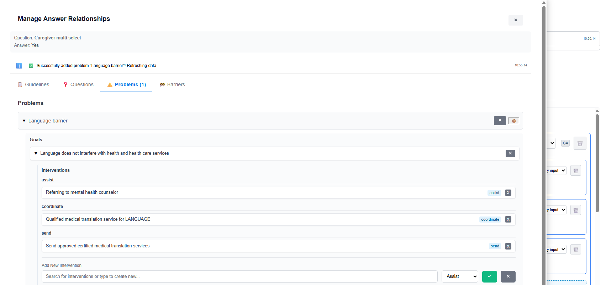
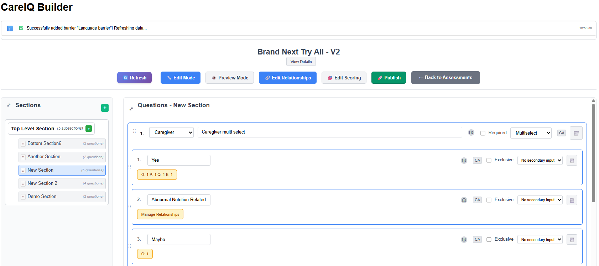
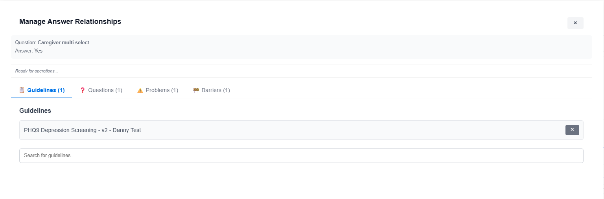
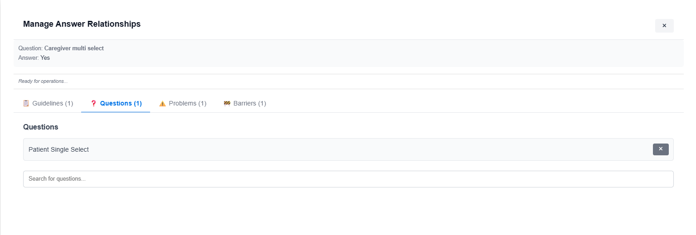
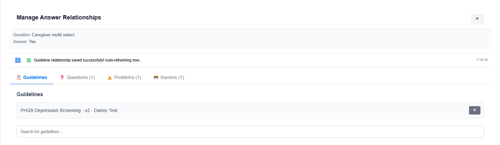
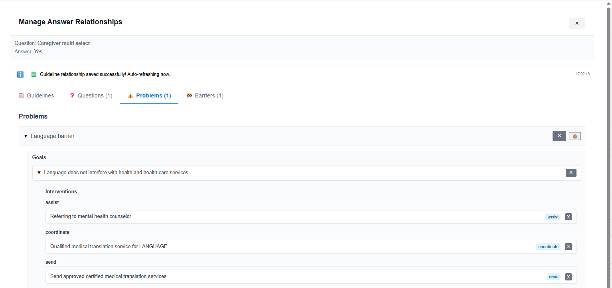
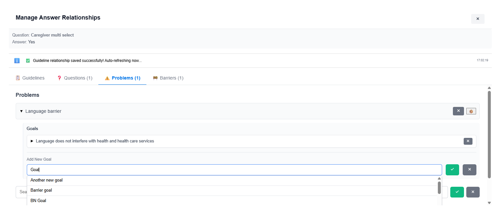
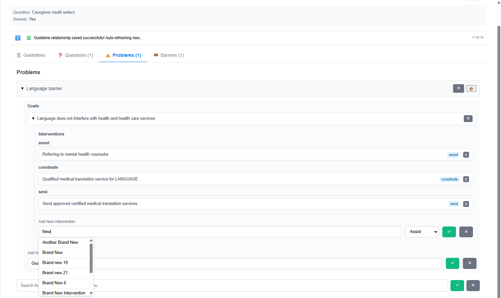
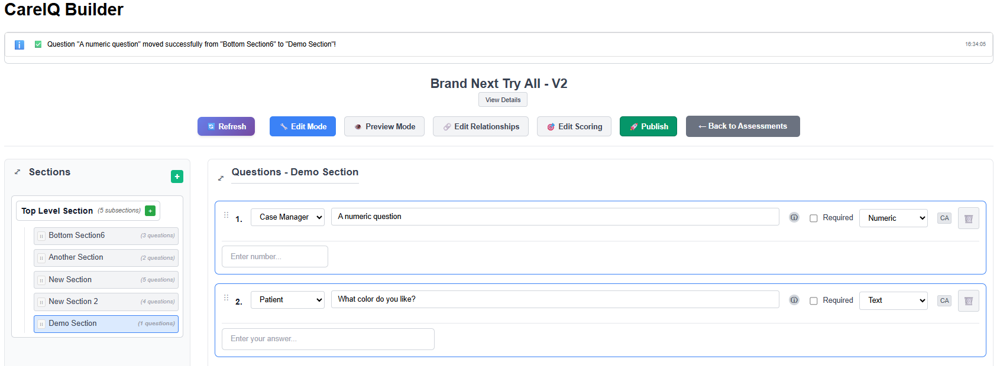

# Relationship Management

## Overview

Relationships connect answers to clinical content like guidelines, triggered questions, problems, goals, and interventions. This enables sophisticated assessment logic and links to care plans. This section covers all types of relationships and how to manage them.

---

## Understanding Relationships

### What Are Relationships?

Relationships are connections between assessment answers and other clinical content. They enable:

- **Conditional Logic**: Show/hide questions based on answer selections
- **Clinical Integration**: Link answers to care plans and guidelines
- **Care Coordination**: Connect assessment results to interventions
- **Evidence-Based Practice**: Associate answers with clinical guidelines

### Types of Relationships

CareIQ Builder supports six relationship types:

| Relationship Type | Description | Example |
|------------------|-------------|---------|
| **Triggered Questions** | Questions that appear when specific answers are selected | "If Yes, when was your last visit?" |
| **Guidelines** | Clinical practice guidelines associated with answers | Link diabetes diagnosis to ADA guidelines |
| **Problems** | Healthcare problems or diagnoses | Link symptoms to clinical problems |
| **Goals** | Care goals associated with problems | Link problem "Diabetes" to goal "HbA1c < 7%" |
| **Interventions** | Actions to achieve goals | Link goal to intervention "Medication management" |
| **Barriers** | Obstacles to care delivery | Link answer to barrier "Transportation issues" |

---



---

## Accessing the Relationship Modal

### Opening Relationships for an Answer

1. **Locate the Answer**
   - Find the answer you want to add relationships to
   - Answer must be part of a saved question

2. **Click Relationship Button**
   - Look for the Edit Relationship button and make sure it is active
   - Click on the badge that lists the number of each relationship on the answer

---



---

3. **Relationship Modal Opens**
   - A modal dialog displays with multiple tabs
   - Each tab represents a relationship type
   - Badge counts show existing relationships

---



---

### Modal Interface

The relationship modal includes:

- **Tab Navigation**: Switch between relationship types
- **Search/Typeahead**: Find content to add
- **Existing Relationships List**: Shows currently linked items
- **Add/Delete Buttons**: Manage relationships
- **Close Button**: Exit modal (changes save automatically)

---

## Triggered Questions (Branch Questions)

### What Are Triggered Questions?

Triggered questions appear only when specific answers are selected. They enable conditional assessment logic.

**Example:**
- Q: "Do you smoke?"
- A: "Yes" → Triggers: "How many cigarettes per day?"
- A: "No" → Question doesn't appear

### Adding a Triggered Question

1. **Open Relationship Modal**
   - Click relationship button on the answer
   - Modal opens

2. **Navigate to Questions Tab**
   - Click the **"Questions"** or **"Triggered Questions"** tab
   - Shows existing triggered questions (if any)

---



---

3. **Search for Question**
   - Type in the search box
   - Typeahead dropdown shows matching questions
   - Only questions from the same assessment appear

4. **Select Question**
   - Click a question from the dropdown results
   - Question appears in a "pending" state

5. **Confirm Addition**
   - Click the checkmark (✓) or **"Add"** button
   - Relationship is saved to backend
   - Success message appears

6. **View Triggered Question**
   - Question now appears in the triggered questions list
   - Shows question text and section location

---

### Removing a Triggered Question

1. **Locate the Triggered Question**
   - In the Questions tab of the relationship modal
   - Find the question you want to unlink

2. **Click Delete Button**
   - Click the delete icon (×)
   - Relationship is removed from backend
   - Question still exists but is no longer triggered by this answer

---

### Testing Triggered Questions

To verify triggered questions work:

1. Click **"Preview Mode"**
2. Navigate to the section with the question
3. Select the answer that should trigger the question
4. The triggered question should appear
5. Deselect the answer
6. The triggered question should disappear

---

## Clinical Guidelines

### What Are Clinical Guidelines?

Clinical guidelines are evidence-based practice recommendations. Linking answers to guidelines:

- Documents clinical decision-making
- Supports evidence-based care
- Provides reference materials
- Enables reporting and compliance tracking

### Adding a Guideline Relationship

1. **Open Relationship Modal**
   - Click relationship button on answer
   - Modal opens

2. **Navigate to Guidelines Tab**
   - Click the **"Guidelines"** tab
   - Shows existing guideline relationships

---



---

3. **Search for Guideline**
   - Type in the search box
   - Typeahead shows matching guidelines from CareIQ library
   - Results include guideline name and source

4. **Select Guideline**
   - Click a guideline from dropdown
   - Guideline appears in pending state

5. **Confirm Addition**
   - Click checkmark or **"Add"** button
   - Relationship is saved
   - Success message appears

6. **View Guidelines**
   - Guidelines appear in list with name and source
   - Badge count on tab updates

---

### Removing a Guideline Relationship

1. **Locate the Guideline**
   - In the Guidelines tab
   - Find the guideline to remove

2. **Click Delete Button**
   - Click delete icon (×) next to guideline
   - Confirmation may appear

3. **Confirm Deletion**
   - Relationship is removed
   - Guideline still exists in library but is no longer linked

---

## Problem-Goal-Intervention (PGI) Management

### Understanding PGI

PGI is a hierarchical clinical care planning model:

```
Problem (e.g., "Uncontrolled Diabetes")
  └── Goal (e.g., "HbA1c < 7% within 3 months")
      └── Intervention (e.g., "Medication adjustment")
      └── Intervention (e.g., "Nutrition counseling")
```

Linking answers to PGI:
- Connects assessment results to care plans
- Triggers care coordination activities
- Documents clinical decision pathways
- Enables outcome tracking

---



---

### Accessing PGI Relationships

1. **Open Relationship Modal**
   - Click relationship button on answer

2. **Navigate to Problems Tab**
   - Click the **"Problems"** tab
   - Shows problem hierarchy with expandable items

---


---

### Understanding the PGI Interface

The Problems tab displays:

- **Problem List**: Top-level problems (collapsed initially)
- **Expand Icons**: Click to load and view goals under a problem
- **Goal List**: Nested under problems (when expanded)
- **Intervention List**: Nested under goals (when goal expanded)
- **Add Buttons**: Add new relationships at each level
- **Delete Buttons**: Remove relationships

---

## Working with Problems

### Viewing Problems

1. **Problems Display Initially Collapsed**
   - Each problem shows only its name
   - Expand icon (▶) indicates collapsible content

2. **Expand a Problem**
   - Click the problem name or expand icon (▶)
   - Goals load from backend (may take a moment)
   - Goals appear nested under the problem
   - Icon changes to collapse (▼)

3. **Collapse a Problem**
   - Click collapse icon (▼)
   - Goals hide from view
   - Expansion state is remembered

---


---

### Adding a Problem Relationship

Problems are typically pre-defined in the system. To link an answer to a problem:

1. **Search for Problem**
   - Use the search box in the Problems tab
   - Type problem name or keyword
   - Matching problems appear in dropdown

2. **Select Problem**
   - Click a problem from results
   - Problem appears in pending state

3. **Confirm Addition**
   - Click checkmark or **"Add"** button
   - Problem relationship is saved
   - Problem appears in the list

---

### Removing a Problem Relationship

1. **Locate the Problem**
   - Find the problem in the list
   - May need to scroll

2. **Click Delete Button**
   - Click delete icon next to problem name
   - Confirmation dialog appears

3. **Confirm Deletion**
   - Click **"Delete"**
   - Relationship removed
   - Problem and its goals/interventions unlinked from this answer

---

## Working with Goals

### What Are Goals?

Goals are specific, measurable outcomes associated with problems. They define what care aims to achieve.

**Examples:**
- Problem: "Hypertension" → Goal: "Blood pressure < 140/90"
- Problem: "Depression" → Goal: "PHQ-9 score < 10"

### Viewing Goals for a Problem

1. **Expand the Problem**
   - Click on a problem in the list
   - Goals load and appear nested beneath

2. **Goals Display**
   - Each goal shows its description
   - Expand icon (▶) indicates goals can be expanded to show interventions

---

### Adding a Goal to a Problem

1. **Expand the Problem**
   - Click to expand the problem you want to add a goal to
   - Goals section becomes visible

2. **Locate Add Goal Button**
   - Look for **"+ Add Goal"** button near the problem
   - Or search box for goals

---



---

3. **Search for Goal**
   - Type in the goal search box
   - Typeahead shows matching goals
   - Results are context-aware for the problem

4. **Select Goal**
   - Click a goal from dropdown
   - Goal appears in pending state

5. **Confirm Addition**
   - Click checkmark or **"Add"** button
   - A loading spinner may appear
   - Goal relationship is saved
   - Goal appears under the problem

---

### Removing a Goal Relationship

1. **Expand the Problem**
   - Click to expand problem containing the goal

2. **Locate the Goal**
   - Find the goal to remove

3. **Click Delete Button**
   - Click delete icon next to goal
   - Confirmation dialog appears

4. **Confirm Deletion**
   - Click **"Delete"**
   - Goal relationship removed
   - Goal's interventions also unlinked

---

## Working with Interventions

### What Are Interventions?

Interventions are specific actions taken to achieve goals. They are the most granular level of the PGI hierarchy.

**Examples:**
- Goal: "HbA1c < 7%" → Intervention: "Metformin 500mg BID"
- Goal: "Blood pressure < 140/90" → Intervention: "Low sodium diet"

### Viewing Interventions for a Goal

1. **Expand the Problem**
   - Click to expand the problem

2. **Expand the Goal**
   - Click to expand the goal
   - Interventions load and appear nested beneath goal

---


---

### Adding an Intervention to a Goal

1. **Expand Problem and Goal**
   - Expand the problem
   - Expand the goal you want to add intervention to

2. **Locate Add Intervention Button**
   - Look for **"+ Add Intervention"** button near the goal
   - Or intervention search box

3. **Search for Intervention**
   - Type in the intervention search box
   - Typeahead shows matching interventions
   - Results are context-aware for the goal

4. **Select Intervention**
   - Click an intervention from dropdown
   - Intervention appears in pending state

5. **Confirm Addition**
   - Click checkmark or **"Add"** button
   - Loading spinner may appear
   - Intervention relationship is saved
   - Intervention appears under the goal

---



---

### Removing an Intervention Relationship

1. **Expand Problem and Goal**
   - Navigate to the goal containing the intervention

2. **Locate the Intervention**
   - Find the intervention to remove

3. **Click Delete Button**
   - Click delete icon next to intervention
   - Confirmation dialog appears

4. **Confirm Deletion**
   - Click **"Delete"**
   - Intervention relationship removed

---

## Working with Barriers

### What Are Barriers?

Barriers are obstacles that may prevent successful care delivery. Linking barriers to answers helps:

- Identify care coordination needs
- Document social determinants of health
- Trigger support services
- Track and address care gaps

**Examples:**
- Transportation issues
- Financial constraints
- Language barriers
- Health literacy challenges
- Housing instability

### Adding a Barrier Relationship

1. **Open Relationship Modal**
   - Click relationship button on answer

2. **Navigate to Barriers Tab**
   - Click the **"Barriers"** tab
   - Shows existing barrier relationships

---

**Screenshot Placeholder 48**: Barriers tab in relationship modal

---

3. **Search for Barrier**
   - Type in the search box
   - Typeahead shows matching barriers
   - Results from barrier library

4. **Select Barrier**
   - Click a barrier from dropdown
   - Barrier appears in pending state

5. **Confirm Addition**
   - Click checkmark or **"Add"** button
   - Barrier relationship is saved
   - Barrier appears in list

---

### Removing a Barrier Relationship

1. **Locate the Barrier**
   - In the Barriers tab
   - Find barrier to remove

2. **Click Delete Button**
   - Click delete icon next to barrier
   - Confirmation may appear

3. **Confirm Deletion**
   - Barrier relationship removed

---

## Viewing All Relationships for an Answer

### Relationship Counts

When viewing an answer card:

- **Relationship indicators** show counts of each type
- Example: "2 Guidelines, 1 Problem, 3 Interventions"
- Click indicator to open modal to that specific tab

---

**Screenshot Placeholder 49**: Answer with relationship counts displayed

---

### Comprehensive Relationship View

To see all relationships at once:

1. **Open Relationship Modal**
   - Click relationship button on answer

2. **Navigate Through Tabs**
   - Click each tab to view that relationship type
   - Badge counts on tabs show number of relationships
   - Example: "Questions (2)", "Guidelines (1)", "Problems (1)"

3. **Review All Content**
   - Guidelines tab: Clinical guidelines
   - Questions tab: Triggered questions
   - Problems tab: PGI hierarchy
   - Barriers tab: Care barriers
   - Evidence tab: Supporting evidence (if available)

---

## Best Practices

### When to Use Triggered Questions

**Good Use Cases:**
- Follow-up details: "If yes, please provide date"
- Conditional assessments: "If smoker, ask about pack-years"
- Branching logic: "If answered X, skip to section Y"

**Avoid:**
- Too many layers of conditional questions (confusing)
- Triggering the same question from multiple answers (ambiguous)
- Circular dependencies (Question A triggers B which triggers A)

---

### Guideline Linking Strategy

**Link Guidelines When:**
- Answer indicates a clinical condition requiring evidence-based care
- Answer triggers care protocols
- Documentation/compliance requires guideline reference

**Example Mappings:**
- "Diabetes diagnosis" → ADA Diabetes Care Guidelines
- "Fall risk identified" → Fall Prevention Guidelines
- "Depression symptoms" → PHQ-9 Screening Protocol

---

### PGI Hierarchy Planning

**Problem Selection:**
- Use standardized problem lists when available
- Link problems to answers that indicate the condition
- Example: Answer "Diabetes" → Problem "Uncontrolled Diabetes"

**Goal Specificity:**
- Goals should be measurable and time-bound
- Link goals that are relevant to the answer
- Example: If answer indicates HbA1c > 8%, link to goal "HbA1c < 7% in 6 months"

**Intervention Relevance:**
- Only link interventions that directly relate to the answer
- Consider immediate vs. long-term interventions
- Example: "Medication non-adherence" → "Medication reconciliation" and "Patient education"

---

### Barrier Documentation

**Link Barriers When:**
- Answer identifies a specific obstacle to care
- Social determinants of health are revealed
- Care coordination needs are identified

**Common Barrier Mappings:**
- "No reliable transportation" → Transportation barrier
- "Cannot afford medications" → Financial barrier
- "Limited English proficiency" → Language barrier

---

## Common Tasks

### Creating a Simple Conditional Question

**Scenario:** Add follow-up question for positive diabetes screening

1. Create main question: "Have you been diagnosed with diabetes?"
2. Add answer: "Yes"
3. Add answer: "No"
4. Save question
5. Create follow-up question: "When were you diagnosed?"
6. Save follow-up question
7. Click relationship button on "Yes" answer
8. Navigate to Questions tab
9. Search for "When were you diagnosed"
10. Select and confirm
11. Test in Preview mode

---

### Linking Answer to Care Plan

**Scenario:** Link depression symptom to care pathway

1. Question: "Have you felt down, depressed, or hopeless?"
2. Answer: "Nearly every day"
3. Click relationship button on answer
4. Navigate to Problems tab
5. Search for problem: "Depression"
6. Select and confirm problem
7. Expand "Depression" problem
8. Add goal: "Reduce PHQ-9 score to < 10"
9. Expand goal
10. Add intervention: "Referral to behavioral health"
11. Add intervention: "PHQ-9 follow-up in 2 weeks"
12. Close modal (saves automatically)

---

### Creating Multi-Level Conditional Logic

**Scenario:** Detailed smoking assessment

1. Main question: "Do you smoke?"
   - Answer: "Yes" (triggers "How much do you smoke?")
   - Answer: "No" (triggers "Have you ever smoked?")
   - Answer: "I quit" (triggers "When did you quit?")

2. Create all questions first
3. Save each question
4. Add triggered question relationships:
   - "Yes" → triggers "How much do you smoke?"
   - "No" → triggers "Have you ever smoked?"
   - "I quit" → triggers "When did you quit?"
5. Test thoroughly in Preview mode

---

## Troubleshooting

### Triggered Question Not Appearing

**Possible causes:**
- Relationship not saved properly
- Still in Edit mode (not Preview)
- Triggering answer not selected
- Question is in different section (navigation issue)

**Solutions:**
1. Verify relationship in modal (should show in Questions tab)
2. Switch to Preview mode
3. Select the exact answer that should trigger the question
4. Check that both questions are in the same assessment
5. Try refreshing the page

---

### Cannot Find Question in Typeahead

**Possible causes:**
- Question not yet created
- Question in different assessment
- Search terms don't match question text
- Question not saved

**Solutions:**
1. Verify question exists and is saved
2. Try different search terms
3. Check that you're in the correct assessment
4. Look for the question manually in sections

---

### PGI Loading Stuck

**Possible causes:**
- Network issue
- Backend timeout
- Invalid problem/goal ID

**Solutions:**
1. Close and reopen modal
2. Check connection status
3. Try expanding different problems
4. Refresh the page
5. Contact administrator if persists

---

### Relationship Modal Won't Close

**Possible causes:**
- Unsaved changes
- Loading operation in progress
- JavaScript error

**Solutions:**
1. Wait for any loading spinners to complete
2. Check for confirmation dialogs
3. Press Escape key
4. Refresh page (may lose unsaved changes)

---

### Duplicate Relationships Appearing

**Possible causes:**
- Relationship added multiple times
- Synchronization issue
- Display bug

**Solutions:**
1. Delete duplicate relationships
2. Refresh the page to verify
3. Check backend data with administrator
4. Clear browser cache

---

### Relationship Deleted But Still Showing

**Possible causes:**
- Deletion didn't save
- Browser cache issue
- Another user re-added it

**Solutions:**
1. Try deleting again
2. Refresh the page
3. Check system messages for errors
4. Clear browser cache
5. Verify with administrator

---

## Tips and Tricks

### Keyboard Navigation

- **Tab**: Move between search boxes
- **Enter**: Confirm selection in typeahead
- **Escape**: Close dropdown/modal
- **Arrow keys**: Navigate typeahead results

---

### Efficient Relationship Management

**Group Similar Answers:**
- If multiple answers need same relationships, consider consolidating
- Example: Instead of separate "Yes, diagnosed 2020" and "Yes, diagnosed 2021", use one "Yes" answer with secondary date input

**Use Templates:**
- For common answer patterns (like Yes/No with follow-ups), create one fully configured set
- Note the relationship structure
- Replicate for similar questions

**Bulk Testing:**
- After adding multiple triggered questions, test all at once in Preview mode
- Create a test matrix: Answer A → Should trigger Q1, Q2; Answer B → Should trigger Q3

---

### Documentation

**Keep Notes:**
- Document complex relationship logic
- Note which answers trigger which questions
- Maintain a care pathway diagram for PGI relationships

**Version Comments:**
- When creating new assessment versions, document relationship changes
- Example: "Added triggered questions for medication assessment"

---

## Next Steps

Now that you understand relationship management:
- Learn how to **test your assessment** in Preview mode
- Understand how **conditional logic** works during assessment completion
- **Publish** your assessment when relationships are finalized
- Create **new versions** when care pathways change

